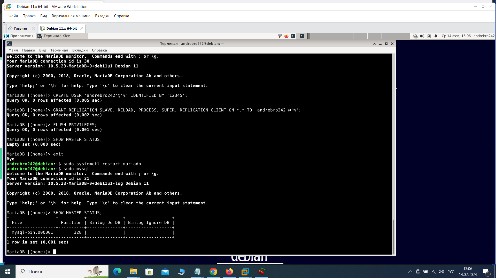
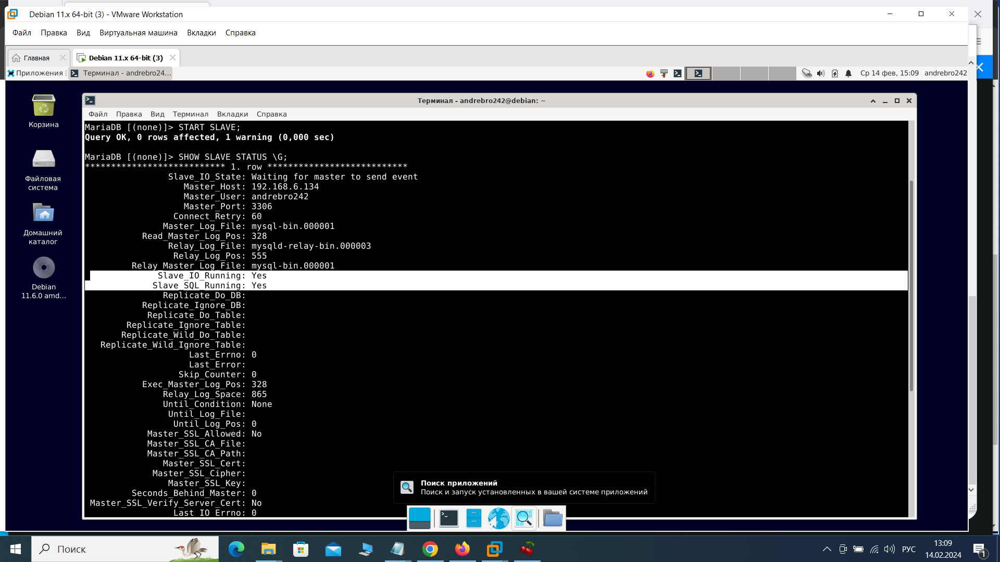
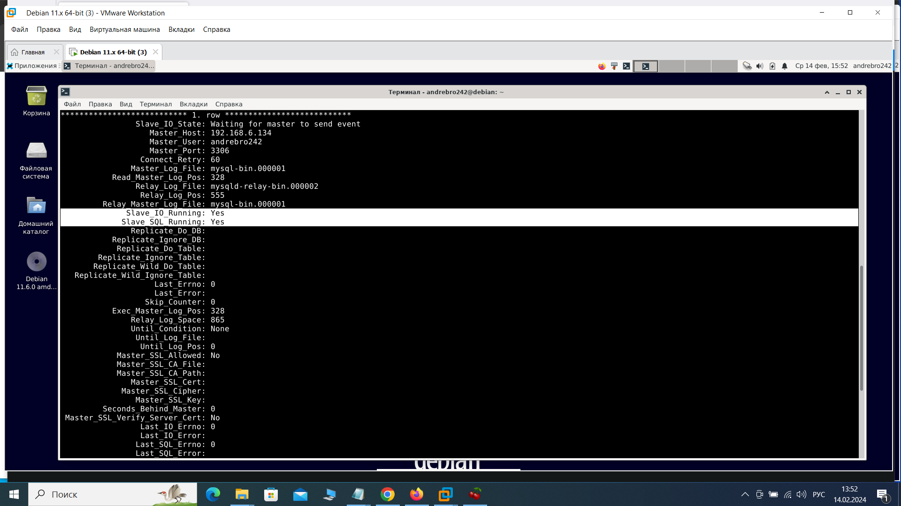
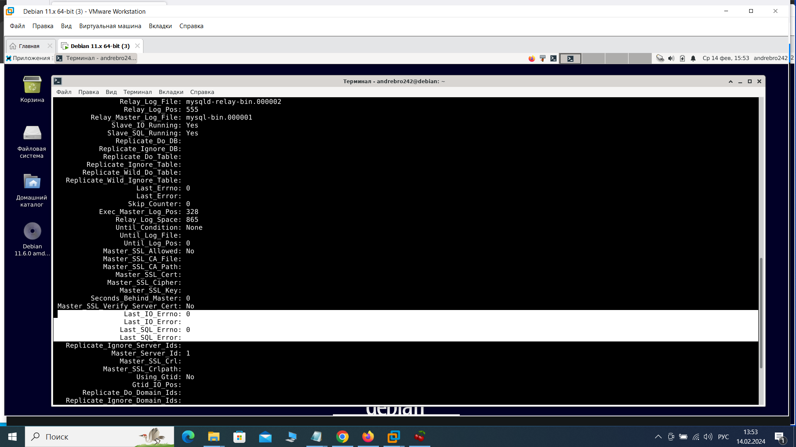

Домашнее задание к занятию «Репликация и масштабирование. Часть 1» Брюхов А SYS-26

Задание 1

На лекции рассматривались режимы репликации master-slave, master-master, опишите их различия.

Ответить в свободной форме.

Решение 1

Режим репликации master-slave:
 Master (главный сервер): Принимает записи и управляет репликацией.
 Slave (вспомогательный сервер): Получает данные от мастера и обновляется в соответствии с изменениями на мастере.
 Однонаправленная репликация: Записи передаются только от мастера к слейву.
 Read-Only доступ: Славы могут использоваться для чтения данных, но записи можно производить только на мастере.
Режим репликации master-master:
 Master-Master (двунаправленная репликация): Оба сервера могут принимать записи и обновлять друг друга.
 Балансировка нагрузки: Запросы на запись можно распределять между мастерами.
 Более сложная настройка и управление: Требует более сложной синхронизации данных и исключения конфликтов.

Выбор между режимами репликации зависит от требований к приложению, его нагрузки, доступности и конфиденциальности данных.

Задание 2

Выполните конфигурацию master-slave репликации, примером можно пользоваться из лекции.

Приложите скриншоты конфигурации, выполнения работы: состояния и режимы работы серверов. 

Решение 2

1. установил MariaDB:

    sudo apt install mariadb-server

Запустил службу MariaDB:

    sudo systemctl start mariadb

Добавил MariaDB в автозапуск:

    sudo systemctl enable mariadb

2. 
2.1 Зашел в MariaDB с правами sudo:

    sudo mysql

(для подключения к MariaDB: mysql -u andrebro242 -p
все пользователи SELECT User, Host FROM mysql.user;)

2.3 Создал пользователя andrebro242:

    CREATE USER 'andrebro242'@'%' IDENTIFIED BY 'password';

2.3 Назначил права пользователю:

    GRANT REPLICATION SLAVE, RELOAD, PROCESS, SUPER, REPLICATION CLIENT ON *.* TO 'andrebro242'@'%';
    FLUSH PRIVILEGES;

2.4 Отредактировал файл конфигурации MariaDB /etc/mysql/mariadb.conf.d/50-server.cnf на Master сервере:

    server-id = 1
    log_bin = /var/log/mysql/mariadb-bin.log
    bind-address            = 192.168.6.134

2.5 
    sudo systemctl restart mariadb

2.6 
    sudo mysql

    SHOW MASTER STATUS;
    +------------------+----------+--------------+------------------+
    | File             | Position | Binlog_Do_DB | Binlog_Ignore_DB |
    +------------------+----------+--------------+------------------+
    | mysql-bin.000001 |      328 |              |                  |
    +------------------+----------+--------------+------------------+
необходимо для настройки Slave сервера

Задание 3*

Выполните конфигурацию master-master репликации. Произведите проверку.

Приложите скриншоты конфигурации, выполнения работы: состояния и режимы работы серверов.

3. Настройка Slave сервера:

    sudo mysql

3.1 Создал пользователя andrebro242:

    CREATE USER 'andrebro242'@'%' IDENTIFIED BY 'password';

3.2 Назначил права пользователю:

    GRANT REPLICATION SLAVE, RELOAD, PROCESS, SUPER, REPLICATION CLIENT ON *.* TO 'andrebro242'@'%';
    FLUSH PRIVILEGES;

3.3 Шаг 3: Настройка slave сервера

3.3.1 файл конфигурации MariaDB /etc/mysql/mariadb.conf.d/50-server.cnf на Slave сервере:

    server-id = 2

3.3.2 Далее sudo mysql

    CHANGE MASTER TO
    MASTER_HOST='192.168.6.134',
    MASTER_USER='andrebro242',
    MASTER_PASSWORD='12345',
    MASTER_LOG_FILE='mysql-bin.000001',  # из таблицы SHOW MASTER STATUS
    MASTER_LOG_POS=328;                  # из таблицы SHOW MASTER STATUS

3.4 Начало репликации на slave сервере

    START SLAVE;

Шаг 5: Проверка состояния репликации на slave сервере

    SHOW SLAVE STATUS \G;

Slave_IO_Running и Slave_SQL_Running имеют значение Yes, что указывает на успешную работу репликации.

Решение 3

1. установил MariaDB:

    sudo apt install mariadb-server

Запустил службу MariaDB:

    sudo systemctl start mariadb

Добавил MariaDB в автозапуск:

    sudo systemctl enable mariadb

2. 
2.1 Зашел в MariaDB с правами sudo:

    sudo mysql

2.2

Создал пользователя andrebro242 на втором сервере:

    CREATE USER 'andrebro242'@'%' IDENTIFIED BY 'password';

2.3 Назначил права пользователю:

    GRANT REPLICATION SLAVE, RELOAD, PROCESS, SUPER, REPLICATION CLIENT ON *.* TO 'andrebro242'@'%';
    FLUSH PRIVILEGES;

2.4 Отредактировал файл конфигурации MariaDB /etc/mysql/mariadb.conf.d/50-server.cnf на Master сервере:

    server-id = 2
    log_bin = /var/log/mysql/mariadb-bin.log
    bind-address            = 192.168.6.136

2.5 
    sudo systemctl restart mariadb

2.6 
Проверил статус репликации на первом мастер-сервере:

    sudo mysql

    SHOW MASTER STATUS;
    +------------------+----------+--------------+------------------+
    | File             | Position | Binlog_Do_DB | Binlog_Ignore_DB |
    +------------------+----------+--------------+------------------+
    | mysql-bin.000001 |      328 |              |                  |
    +------------------+----------+--------------+------------------+

    на втором мастер-сервере выполнил следующие команды:

    STOP SLAVE;
    CHANGE MASTER TO MASTER_HOST='192.168.6.134',
    MASTER_USER='andrebro242', 
    MASTER_PASSWORD='пароль', 
    MASTER_LOG_FILE='mysql-bin.000001', 
    MASTER_LOG_POS=328;
    START SLAVE;

Проверил статус репликации на втором мастер-сервере:

    SHOW SLAVE STATUS\G;

Параметр Slave_IO_Running и Slave_SQL_Running показывают Yes, что означает успешное подключение и работу репликации. Также важно проверить, что ошибок нет ( поле Last_Errno. Если значение этого поля не равно 0, это указывает на наличие ошибки в процессе репликации).

